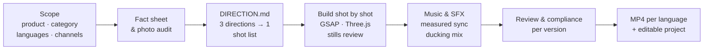

<div align="center">

# Rami EC Product Video Skill

**Turn product photos and spec sheets into clear, listing-ready e-commerce product videos — with an AI agent.**

English · [简体中文](README.zh-CN.md)

[](LICENSE)


</div>

---

An agent skill for **cross-border e-commerce sellers**. Hand it real product photos, spec sheets and listing text; it builds a sourced fact sheet, writes copy in each target language, animates the real photos with code, composes original music, places action sound effects, and exports an MP4 per language plus a fully editable project.

It is built around three promises:

- **It looks like the actual product.** Product shots only use real photos — no AI-generated or repainted product visuals.
- **One glance tells you how it's used.** Every visual device must trace back to something the product really has.
- **Every claim has a source.** Numbers, certifications and efficacy claims come from a fact sheet with file-and-page references.

> [!TIP]
> Letting a model go straight from raw assets to a rendered MP4 gives poor results. Start at lower effort and keep a human in the loop — especially until the model understands how the product is used, where it mounts and how big it is. Confirm the fact sheet and direction first, review a few stills, then render the full film.

## Highlights

| | Built in | What it covers |
| --- | --- | --- |
| **Languages** | English (default), 日本語, Deutsch, Français, 简体中文 | Per-language copywriting, typography, line-breaking and reading speed. Asked at project start. |
| **Channels** | Amazon US / UK / DE / FR / JP | Common rejection wording and local rules (FTC, Japan's Premiums and Representations Act, German UWG, France's Loi Toubon, the EU green-claims rules applying from Sept 2026…) |
| **Categories** | Motorcycle accessories, consumer electronics, beauty & personal care | Extra fact fields, claims that need evidence, category no-gos (e.g. cosmetics can't claim to treat), shooting risks, motif sources |

One timeline, many language versions: picture, music and SFX are shared; only on-screen text changes per version. Layout is designed for the longest language.

> [!NOTE]
> Multi-language works, but two languages per project is the sweet spot. For more, duplicate the project and adapt it.

Need another category, language or marketplace? Each is **one note + one block of rule data + one test** — see [Extending](#extending).

## How it works



1. **Scope** — product, category, selling points, audience, language versions, marketplace per version, aspect ratio, style.
2. **Facts & assets** — a fact sheet where every row cites its source; photos checked for resolution, cutouts, third-party logos and personal data.
3. **Direction first** — break down references, distill the product's character, propose three distinct directions and pick one. Every device is written as *"because the product has X, we use Y."*
4. **Build shot by shot** — a `seek(t)` runtime with a GSAP master timeline and Three.js / canvas layers, rendered frame by frame with Playwright; stills after each shot.
5. **Sound** — original music arranged from shot boundaries; real recorded SFX first (snaps, zips, magnets, pumps), synthesized only for gaps; onsets measured and aligned within two frames; music ducks under key sounds.
6. **Review & compliance** — contact sheets, transition strips and full-size frames for each version, then automated checks per language, channel and category.

## Quick start

Drop this folder into your agent's skills directory and restart the session:

| Agent | Path |
| --- | --- |
| Claude Code | `~/.claude/skills/Rami-EC-product-video-skill` |
| Codex | `~/.agents/skills/Rami-EC-product-video-skill` |

Then ask:

> Use Rami-EC-product-video-skill to make an Amazon product video for our 65W GaN charger, in English and German. Assets are in `D:\Products\charger-65w`. Landscape, 45 seconds. Sort out the selling points and facts first, show me a few key frames, then continue with animation and sound.

On first run it checks Node.js, Python, FFmpeg and the render dependencies, and only installs what is missing.

### Prompts that work well

Say **what you sell, to whom, on which marketplaces, in which languages**:

> A magnetic wireless power bank. Focus on Qi2 magnetic alignment and the 10,000 mAh capacity. Audience: commuting iPhone users. Amazon US and Japan, landscape, 30 s. Use our brand style.

> This hydrating serum needs English, French and German versions. Organize the ingredients and efficacy evidence first, and tell me which claims we can't use.

> The install segment drags — cut it to 4 seconds. Add a clear "click" when it snaps on, and duck the music there.

## Three styles

| Style | When to use |
| --- | --- |
| **`brand`** · recommended | The brand has a logo, colors and an existing look; the video should feel unmistakably theirs |
| **`default`** | Brand assets are thin; start from a neutral package (charcoal / concrete grey + an accent taken from the product) |
| **`hybrid`** | Keep the logo and brand colors, redesign layout and pacing for the video |

## What you get

- An upload-ready **MP4 for each language version**.
- A **reproducible video project** you can keep editing and re-rendering.
- Evidence files: fact sheet, asset usage list, audio sources and check reports.

Automated checks catch structure, file, timeline and wording problems. Whether copy reads well, frames look good and sound feels right still needs real viewing and listening — ideally a native speaker reads each version. Amazon's rules and local laws change; the built-in notes are **not legal advice**, so confirm against Seller Central and local regulations before uploading.

## Requirements

| Dependency | Used for |
| --- | --- |
| Node.js ≥ 22, npm | Browser rendering |
| Python ≥ 3.9 | Project init, environment check, mixing and delivery checks |
| FFmpeg / ffprobe | Audio processing, video encoding, media inspection |
| Playwright Chromium | Stills and frame-by-frame export (WebGL via SwiftShader) |
| GSAP, Three.js (optional) | Master timeline animation, background effect layers (installed per project) |
| Fonts per language | e.g. Inter, Noto Sans JP / SC (licensed, copied into the project) |

See [onboarding](references/onboarding.md) for installation notes (in Chinese).

## Repository layout

```text
SKILL.md              Workflow, hard constraints and tool entry points
agents/               Codex display metadata
references/           Product & brand audit, assets, direction, visual vocabulary, story & copy,
                      render pipeline, music & SFX, mixing & QA, review, onboarding, case study
  categories/         Category notes: motorcycle parts, electronics, beauty, template
  locales/            Language notes: en, ja, de, fr, zh-Hans
  channels/           Channel notes: Amazon common + US / UK / DE / FR / JP
scripts/              Init, environment check, SFX synthesis, SFX landmarks, mixing, delivery check
  data/               Locale, channel, wording and category rules (JSON)
tests/                Regression tests
```

The skill's instructions and reference notes are written in Chinese; the agent produces copy in whichever languages you choose.

## Extending

| To add | Touch |
| --- | --- |
| A category | `references/categories/<name>.md` (from `_template.md`) + an entry in `scripts/data/categories.json` + a wording test |
| A language | `references/locales/<locale>.md` + `scripts/data/locales.json` (reading rate, default font, placeholders) |
| A marketplace | `references/channels/<channel>.md` + `scripts/data/channels.json` (+ patterns in `claims.json` if needed) |

Run the tests before opening a PR:

```bash
python3 -m unittest discover -s tests
```

## License

Modified from [op7418/guizang-product-video-skill](https://github.com/op7418/guizang-product-video-skill) (a software-product promo skill), which is licensed under GNU AGPL-3.0. This modified version remains **GNU AGPL-3.0**. When redistributing, include the full license text ([LICENSE](LICENSE)), keep the original copyright notices, and state your changes.

Product photos, logos, fonts and any third-party music or sound effects used in a project are governed by their own licenses.
