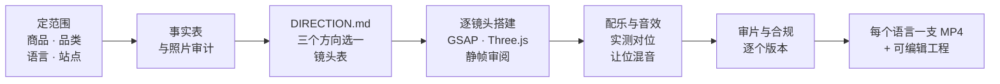

<div align="center">

# Rami EC Product Video Skill

**把商品照片和规格书交给 AI，做出一支讲得清楚、能上架的跨境电商商品视频。**

[English](README.md) · 简体中文

[](LICENSE)


</div>

---

面向**跨境电商卖家**的 AI Agent Skill。交给它真实的商品照片、规格书和商品页文字，它会整理带出处的事实表、按目标语言分别写文案、用代码给实拍照片做动画、原创配乐、对位动作音效，最后为每个语言版本导出一支 MP4，并留下可以继续修改的工程。

重点是三件事：

- **看起来就是这件商品。** 商品画面只用真实照片，不用 AI 生成或改画商品外观。
- **一看就知道它怎么用。** 每个视觉手法都要能说出它对应商品的哪一点。
- **说的每句话都有依据。** 数字、认证、功效说法都来自事实表，每项写明出自哪个文件哪一页。

> [!TIP]
> 让模型直接从素材一路做到渲染好的 MP4，结果很不如人意。正确做法是初期降低 effort，多加人工判断，特别是在模型理解商品的正确用法、安装位置和尺寸之前：先确认事实表和方向，再出几张静帧确认，然后才做全片。

## 亮点

| | 内置 | 说明 |
| --- | --- | --- |
| **语言** | English（默认）、日本語、Deutsch、Français、简体中文 | 每种语言有自己的文案写法、排版与断行规则、阅读速度；开工时问做哪些语言 |
| **渠道** | Amazon US / UK / DE / FR / JP | 各站点的常见拒审措辞和当地法规要点（FTC、景品表示法、德国 UWG、法国 Loi Toubon、2026 年 9 月起适用的欧盟环保说法新规等） |
| **品类** | 摩托车周边、3C 电子 / 配件、美妆 / 个护 | 事实表补充字段、必须有出处的说法、品类禁区（如化妆品不能宣称治疗）、拍摄风险、母题来源 |

一条时间线，多个语言版本：画面、配乐和音效共用，只有屏幕文字随版本变化；版式按最长的语言设计。

> [!NOTE]
> 虽说支持多语言，但一次建议最多做两个语言，再多就复制工程以后去修改。

需要别的品类、语言或站点？每一项都是**一份笔记 + 一段规则数据 + 一条测试**，见 [扩展](#扩展)。

## 工作方式



1. **先定范围。** 确认商品、品类、卖点、目标顾客、语言版本、各版本的发布站点、画幅和风格。
2. **整理事实与素材。** 从规格书建事实表（每项有出处），审核照片的分辨率、抠图和场景照里的第三方 Logo / 个人信息。
3. **先定方向。** 拆解参考，提炼商品气质，提出三个差异明显的方向并选定；每个手法都写成"因为商品有 X，所以用 Y"。
4. **逐镜头搭建。** `seek(t)` 运行时，GSAP 主时间轴编排动画，Three.js / canvas 做背景和效果层，Playwright 逐帧导出；每个镜头搭完就出静帧对照。
5. **把声音配好。** 按镜头边界编曲；音效优先用真实录音（扣合、拉链、磁吸、泵头），缺项才合成；实测落点，音画误差控制在两帧以内，关键音效出现时音乐让位。
6. **审片与合规检查。** 每个版本看联系表、转场条带和全尺寸帧，再按语言、站点和品类跑自动检查。

## 快速开始

把本文件夹放进 AI 工具的 skills 目录，重新打开会话：

| 工具 | 路径 |
| --- | --- |
| Claude Code | `~/.claude/skills/Rami-EC-product-video-skill` |
| Codex | `~/.agents/skills/Rami-EC-product-video-skill` |

然后说：

> 用 Rami-EC-product-video-skill，给我们的 65W 氮化镓充电器做一支 Amazon 商品视频，出英文和德文两个版本。素材在 D:\Products\charger-65w，横版 45 秒。先整理卖点和事实，给我看几张关键画面，再继续做动画和声音。

首次使用会检查 Node.js、Python、FFmpeg 和渲染依赖，缺什么再按官方安装方式补什么。

### 怎么提需求比较容易一次做好

把**卖哪件商品、给谁看、发在哪些站点、要哪些语言**说清楚就够了：

> 介绍这款磁吸无线充电宝，重点讲 Qi2 磁吸和 10000mAh 容量。目标是通勤的 iPhone 用户，发 Amazon 美国和日本，横版 30 秒。沿用品牌风格。

> 这支保湿精华要出英、法、德三个版本，先整理成分和功效依据，哪些说法不能用先告诉我。

> 安装那一段太慢了，压缩到 4 秒。扣上去的时候加一个清楚的"咔"声，音乐让一下。

## 三种风格

| 模式 | 适合什么情况 |
| --- | --- |
| **品牌风格 `brand`** · 推荐 | 品牌有 Logo、品牌色和既有设计，希望视频一眼就是自己的品牌 |
| **默认风格 `default`** | 品牌素材不全，用中性包装（深炭灰 / 水泥灰 + 从商品主色取的强调色）开始 |
| **混合 `hybrid`** | 保留品牌 Logo 和品牌色，外层排版和节奏为传播重新设计 |

## 最后会拿到什么

- 每个语言版本一支可以上传的 **MP4**。
- 一个可以继续修改、重新渲染的 **视频工程**。
- 事实表、素材使用清单、声音来源和检查记录，方便以后追溯与调整。

自动检查能发现部分结构、文件、时间线和措辞问题；文字是否好懂、画面是否舒服、声音是否合适，还需要实际观看和试听，非母语的版本最好请母语者读一遍。Amazon 的视频规则和各国法规会更新，内置的法规笔记**不是法律意见**，上传前以 Seller Central 和当地规定为准。

## 环境要求

| 依赖 | 用途 |
| --- | --- |
| Node.js ≥ 22、npm | 运行浏览器渲染 |
| Python ≥ 3.9 | 初始化工程、环境检查、混音和交付检查脚本 |
| FFmpeg / ffprobe | 音频处理、视频编码和文件检查 |
| Playwright Chromium | 静帧和逐帧渲染（WebGL 走 SwiftShader） |
| GSAP、Three.js（可选） | 主时间轴动画、背景效果层（装在视频工程里） |
| 各语言字体 | 例如 Inter、Noto Sans JP / SC（确认授权，放进视频工程） |

依赖安装说明见 [入门与依赖检查](references/onboarding.md)。

## 仓库结构

```text
SKILL.md              工作流、硬约束和工具入口
agents/               Codex 的展示信息
references/           商品与品牌审计、素材处理、影片方向、视觉手法、分镜文案、渲染管线、
                      配乐音效、混音验收、审片、依赖安装、案例复盘
  categories/         品类笔记：摩托车周边、3C 电子、美妆个护、新品类模板
  locales/            语言笔记：en、ja、de、fr、zh-Hans
  channels/           渠道笔记：Amazon 通用与 US / UK / DE / FR / JP
scripts/              初始化、环境检查、合成音效、音效落点测量、混音、交付检查
  data/               语言、渠道、措辞、品类规则（JSON）
tests/                脚本回归测试
```

## 扩展

| 要加 | 改哪里 |
| --- | --- |
| 品类 | `references/categories/<name>.md`（从 `_template.md` 复制）+ `scripts/data/categories.json` 加条目 + 一条措辞测试 |
| 语言 | `references/locales/<locale>.md` + `scripts/data/locales.json`（阅读速度、默认字体、占位文案） |
| 站点 | `references/channels/<channel>.md` + `scripts/data/channels.json`（需要时在 `claims.json` 补关键词） |

提交 PR 前运行：

```bash
python3 -m unittest discover -s tests
```

## License

本 skill 修改自 [op7418/guizang-product-video-skill](https://github.com/op7418/guizang-product-video-skill)（软件产品宣传片），原作品采用 GNU AGPL-3.0，修改版继续采用 **GNU AGPL-3.0**。分发时请附上 AGPL-3.0 全文（[LICENSE](LICENSE)）、保留原作者版权声明，并说明修改内容。

使用的商品照片、Logo、字体、第三方音乐或音效，依各自适用许可使用。
